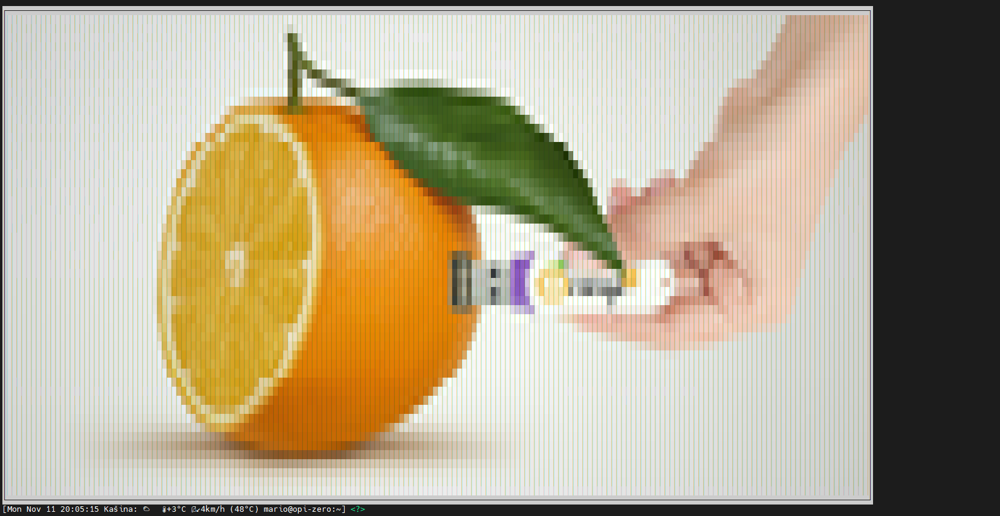
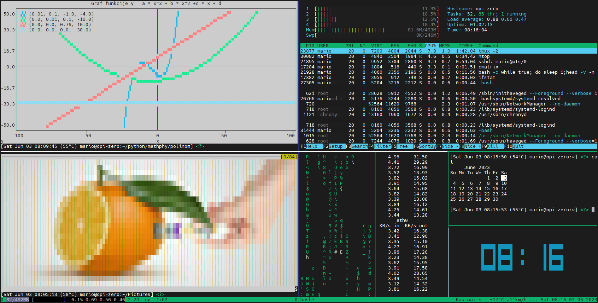

# plotext-ranger and piv (plotext image viewer)
Plotext usage in ranger file manager for viewing graphics files and python scripts for showing images (jpg, png, bmp, tiff, ps, eps, gif) in terminal.

Python scripts piv2 and pivgif2 are python scripts for showing graphics files in ranger file manager. piv and pivgif are good from command line and inside directory with using only graphic file name, for example: "piv sample.png" or "pivgif sample.gif". piv2 and pivgif2 need absolute path of graphic filefile.

Install plotext with:
  "pip install plotext" or
  "pip3 install plotext"
  
Put python scripts in some map and export path of that map.
  
Add ranger config file rifle.conf to ~/.config/ranger/rifle.conf. Add piv, piv2, pivgif and pivgif2 location to PATH variable.

Scripts depend on other python modules: sys, os and pillow.

piv, piv2, pivgif and pivgif2 calculate aspect ratio transformation for plt.plotsize() and ajust it to my terminal size plt.ts().

There is also script terminal-size.py, which gives for my terminal 206 character columns and 57 character rows. So I calculeted factor of correction 1.82 for my terminal, as 55/57×206 I round to 200. and then 200/(55×2)=1.82 (×2 because on eye to me it looks that character height size is almost double character widht size) applied to line: new_width = int(terminal_height * original_width/original_height * 1.82).

Why I did this?
I have Orange Pi Zero with only 2 GB micro sd card. There is not possible to have desktop environment so I needed something for .jpg, .png, .bmp and .gif.
I used asciiview and cacaview and than I found piccolomo/plotext repository. In many cases plotext is better solution for terminal view of graphics files than asciiview or cacaview.

How it looks in action?

Bash terminal:

tmux terminal:

